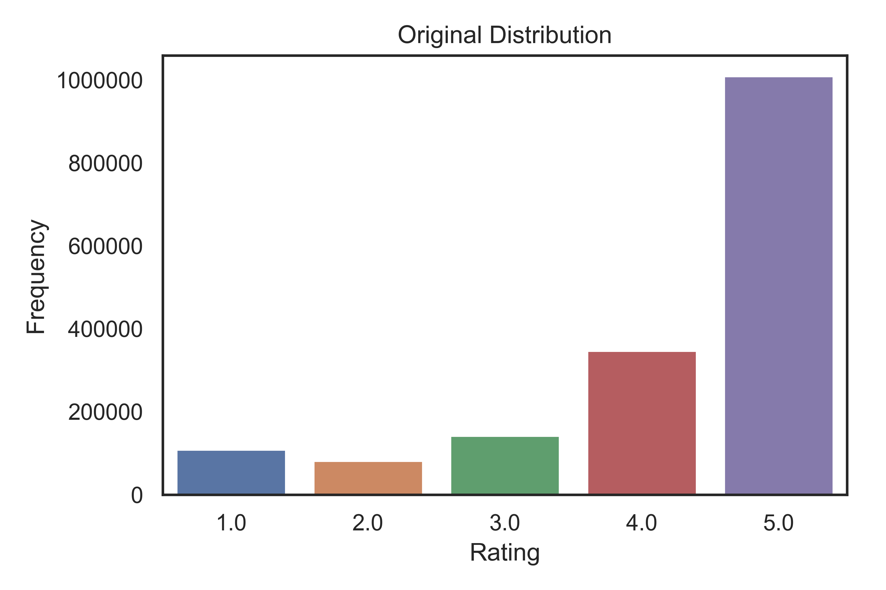
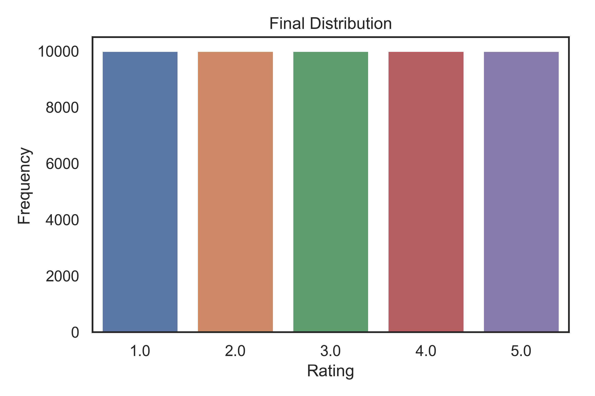

# Amazon_Reviews_NLP_Project

Contributors: Kristina Barounis & Gal Gilor

## Intro 

This project utilizes natural language processing techniques on a dataset of customer reviews from Amazon's electronic products department to answer the following two questions:

1. Do written reviews of Amazon products align with their associated ratings?
2. What are the most commonly discussed topics in these reviews?

- [Tech Stack](#tech-stack)

- [Process](#process)

- [Data and EDA](#data-and-eda)
    - [Topic Modeling](#topic-modeling)
    
- [Classifier](#classifier)

- [Future Improvements](#future-improvements)

## Tech Stack

- Python libraries
    - Pandas
    - NLTK
    - Spacy
    - Gensim
    - Scikit-learn
    - Matplotlib
    - Seaborn

## Process

For this project, we used a Stanford dataset of Amazon electronic product reviews spanning 18 years. We cleaned the data using standard NLP techniques (i.e. removing stop words and punctuation, lemmatizing, and tokenizing). As part of our EDA process, we also used the unsupervised topic modeling algorithm, LDA, to cluster reviews into topics. We then used supervised classification algorithms to classify reviews into rating buckets (1-5). 
  
## Data and EDA

The original dataset contained 1.7 million reviews on electronic products sold on Amazon. We dropped 1.2 million of the reviews to reduce class imbalance across rating buckets, and for processing efficiency, ultimately resulting in 250,000 observations.

 

We completed a number of pre-processing and data cleaning steps including removing punctuation and stop words, making all letters lowercase, and lemmatizing words. Each of these steps was performed so that words could be grouped together based on their lemma and weren't instead treated as individual, unique words.

As part of our exploration, we looked at the most common words and bigrams in our corpus. As expected, the most common words and bigrams  are stop words, which we remove from the corpus in the pre-processing stage. Many of the most common words are also removed during the vectorization step, in which we require words to appear in less than 50% of the documents. 

**Before removing stop words**

   

After removing stop words, the list of top words and bigrams now give us more insight into what the reviews are really about. Interestingly, many of the most common bigrams show up as key components of the topics produced by the unsupervised LDA model.

**After removing stop words**
.png) .png) 

We also engineered a number of features. However, these were ultimately excluded from the models as it became evident that these features had little impact on leading to accurate predictions of ratings.
- number of words in a review
- number of exclamation points used in a review
- number of question markers used in a review

### Topic modeling
Lastly, as an additional step in exploring our data, we used the Gensim library to perform topic modeling on our corpus. This helped us understand what the key discussion points were across our 50k reviews.

We created word clouds to visualize the key words that comprise each topic. The size of the word is proportional to its weight in the topic. As mentioned above, some of the words that appeared as common bigrams appear here as key words in some of the topics (e.g.: usb, battery). However, these topics seem to be mostly divided by product, whereas the bigrams reflected the customer's sentiment about products (e.g. work well, work fine, would recommend).

 

## Classifier

Here we only discuss our initial and final models. For a look at the additional models we tested, please see the python notebook titled Supervised_Models.

1. Dummy Classifier:
- The Dummy Classifier acheieved an accuracy score of 20%, given our data is distributed across 5 rating categories

2. Multinomial Naive Bayes
- The Multinomial Naive Bayes model was able to achieve the highest accuracy score of 47%
- We used NLTK's TF-IDF vectorizer with the following parameters: 
    - A maximum of 10,000 features 
    - Each word was required to appear in a minimum of 2 reviews
    - Each word was required to appear in no more than 50% of the reviews
    

The confusion matrix shows the accuracy of the model across rating buckets. The model performed best when predicting ratings of 1 and 5, with 73% and 66% of the observations correctly classified, respectively. This is in line with our expectations, given these are likely to be the reviews with the most polarizing language. Additionally, the model performed worst on reviews with ratings of 2 given we had the fewest observations in this rating bucket. 

## Future Improvements

- Expand list of stop words to help improve topics derived via LDA
- Run and evaluate additional LDA models to find optimal number of topics
- Use topics derived from LDA as feature in our NB model
- Test out VADER scores as potential feature in our NB model
